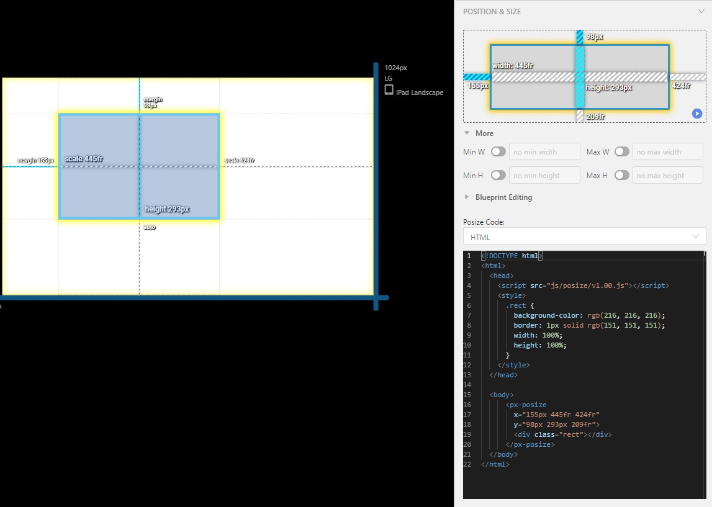

# posize

Posize is the flexible layout tool which implements the concept of resizing constraints.

There is also react version [here](https://github.com/px2code/react-posize)

## Description

All popular design tools have the concept of resizing constraints, such as [Sketch](https://www.sketch.com/docs/designing/layer-basics/resizing-constraints/), [Figma](https://help.figma.com/hc/en-us/articles/360039957734-Apply-Constraints-to-define-how-layers-resize), and [AdobeXD](https://helpx.adobe.com/xd/help/using-responsive-resize.html). It's very useful to define the responsive behavior which describes how to position and resize an item across different resolutions.


[pxCode](https://pxcode.io), an online editor which help users to convert design files into responsive web code, widely uses posize to achieve responsiveness.

\
**Posize Demo**\


## Why Posize rather than CSS margin ?

Traditional CSS margin is useful but limited. CSS margin can't be proportional without using complicated `calc` syntax. And the vertical margin (margin-top and margin-bottom) can't use precent intuitively because the percentage is in terms of the parent width, not height.


## Features

- Supports proportional and fixed margin
- Support both direction - vertical and horizontal
- Support MediaQuery

## Demo

Try the posize [PLAYGROUND](https://www.pxcode.io/playground/posize) or [CODESANDBOX](https://codesandbox.io/s/posize-demo-l5jqe?file=/index.html)



## Installation

### CDN 

just add the script in your `<head>`
```html
<script src="https://cdn.jsdelivr.net/gh/px2code/posize/build/v1.00.js"></script>
```

## Usage

### Examples

```html
<px-posize 
  x="176fr 546fr 558fr" 
  y="150px 379px 191fr">
  ...
</px-posize>
```

posize with MediaQuery, max, xxxl, xxl, xl, lg, md, sm, xs 
```html
<px-posize
  x="20px 546fr 558fr"
  y="20px 379px 191fr"
  md-x="1fr minmax(400px,2fr) 1fr"
  md-y="150px 379px 1fr"
  xs-x="10px 1fr 10px"
  xs-y="150px 379px 1fr">
  ...
</px-posize>
```      


### Settings
| name| Type| Default value | Description |
| ------------- |:-------------:| -----:|-----:|
|x|String \| Array| "0px 1fr 0px" | the parameters for left, width and right|
|y|String \| Array| "0px 1fr 0px" | the parameters for top, height and bottom|
|z-index|Number|0| set zIndex into track `div`

## Syntax

The syntax of `x` and `y` is the same to CSS grid.
- `?px` means pixel which is fixed value
- `?fr` means "fraction" which means proportional to the sibling.
- `?%` means "perentage" which means proportional to the parent.
- `max-content` means largest maximal content contribution.
- `minmax(?px, ?fr)` means a size range greater than or equal to min and less than or equal to max.
- `minmax(?px, max-content)` means a size range greater than or equal to min and less than or equal to max-content.


## Implementation

posize use the [Web Component](https://developer.mozilla.org/en-US/docs/Web/Web_Components) to simpify the usage and it use 3 x 3 [CSS Grid](https://developer.mozilla.org/en-US/docs/Web/CSS/CSS_Grid_Layout/Basic_Concepts_of_Grid_Layout) internally for the layout arrangement.

## Browsers support

| [](http://godban.github.io/browsers-support-badges/)<br/>Edge | [](http://godban.github.io/browsers-support-badges/)<br/>Firefox | [](http://godban.github.io/browsers-support-badges/)<br/>Chrome | [](http://godban.github.io/browsers-support-badges/)<br/>Safari | [](http://godban.github.io/browsers-support-badges/)<br/>iOS Safari |
| :---------: | :---------: |  :---------: |  :---------: |  :---------: |
| 79+ | 63+ | 67+ | 10.1+ | 10.3+


## License

This project is licensed under the terms of the [MIT license](https://github.com/mui-org/material-ui/blob/next/LICENSE).
